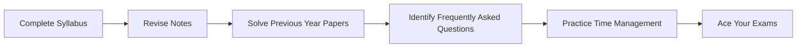

# 📚 RGPV 6th Semester Previous Year Papers

> *"The more papers you solve, the fewer surprises you face in the exam."*

A collection of **RGPV 6th Semester Previous Year Question Papers (PYQs)** for Computer Science students to help with exam preparation, revision, and understanding the question pattern.

---

## 📖 Subjects Included

| Subject Code | Subject Name |
|--------------|--------------|
| **CS-601** | Machine Learning |
| **CS-602** | Computer Networks |
| **CS-603** | Compiler Design |
| **CS-604** | Project Management |

---

## 📂 Repository Structure

```text
6th-Semester-RGPV-Paper/
│
├── CS-601 Machine Learning/
│   ├── 2025.pdf
│   ├── 2024.pdf
│   └── ...
│
├── CS-602 Computer Networks/
│   ├── 2025.pdf
│   └── ...
│
├── CS-603 Compiler Design/
│   ├── 2025.pdf
│   └── ...
│
├── CS-604 Project Management/
│   ├── 2025.pdf
│   └── ...
│
└── README.md
```

---

## 🎯 Repository Features

- 📄 Previous Year Question Papers
- 📚 Subject-wise Organization
- 🎯 Quick Revision
- 📝 Useful Before MST & End Semester Exams
- 💯 Free and Open for Everyone

---

## 🚀 Preparation Roadmap



---

## 📌 Why Previous Year Papers?

Previous year papers help you:

- Understand the exam pattern
- Identify repeated questions
- Improve answer writing speed
- Practice important numerical and theoretical questions
- Boost confidence before exams

---

## 🤝 Contributions

Missing a paper?

You are welcome to contribute.

1. Fork this repository
2. Add the missing paper(s)
3. Create a Pull Request

Every contribution helps fellow RGPV students.

---

## ⭐ Support

If this repository helps you in your exam preparation,

**Please consider giving it a ⭐.**

It encourages me to upload more study resources for RGPV students.

---

## 📜 License

This repository is licensed under the **MIT License**.

---

<div align="center">

### 📖 Study Smart • Practice More • Score Better

**Made with ❤️ for RGPV Students**

</div>
